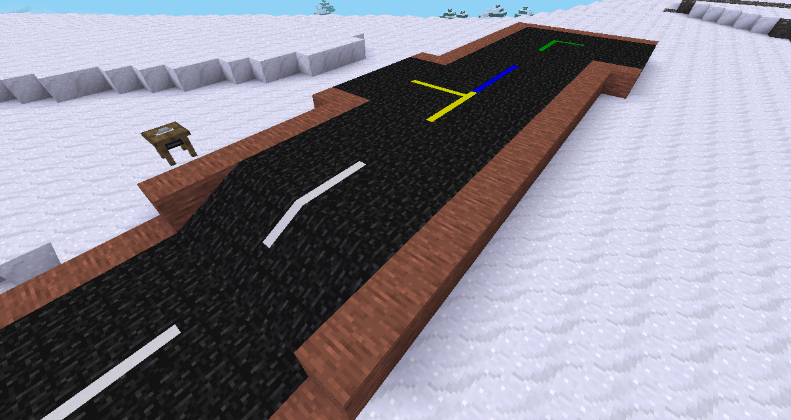

# Basic streets

Simple tar-based street nodes with markings for straight,corner,crossing and t-junction

# Mod interop

Optional mods:
* `moreblocks`: registers all nodes to the circular saw if available
* `default`: for the sounds
* `dye`: for the recipes
* `unifieddyes`: makes the non-circular-saw nodes colorable
* `building_blocks`: uses the `building_blocks:Tar` node if available (otherwise registers its own base-variant)
* `player_monoids`: increases the players running speed on tar nodes

# License

## Code

MIT

## Media

* `textures/basic_streets_solid_*` CC-BY-SA 3.0 https://github.com/minetest-streets/streets
* `textures/basic_streets_tar.png` CC-by-SA 4.0 https://gitlab.com/VanessaE/homedecor_modpack/-/tree/master/building_blocks/textures